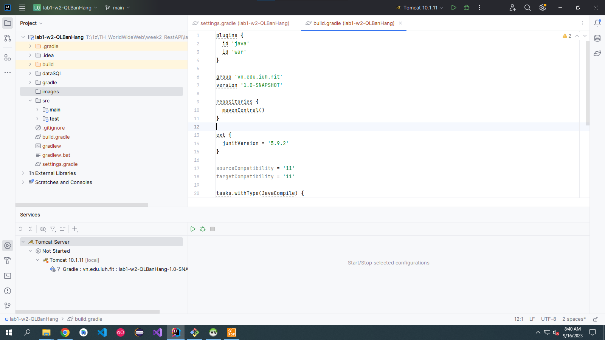
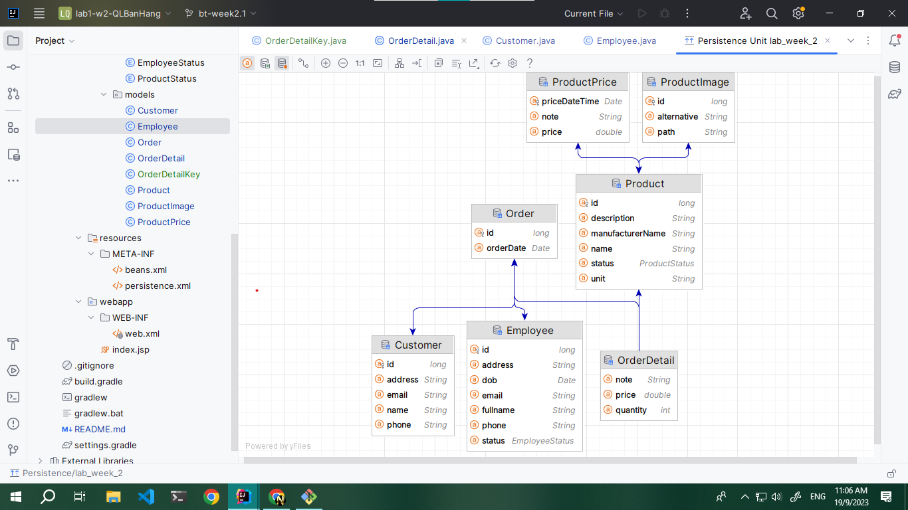

# bai tap tuan 2 - myShop

## Note: 
### persistence.xml :
sự khác nhau của transaction-type( [link stackoverflow](https://stackoverflow.com/questions/17331024/persistence-xml-different-transaction-type-attributes) )

### anh minh hoa

-Ảnh JPA Entity

### Tài liệu hướng dẫn
[youtobe](https://youtu.be/_05loTjyonk)

tài liệu web
- [Jpa](https://levunguyen.com/laptrinhspring/2020/04/13/su-dung-spring-jpa-trong-springboot/)
- [many-to-many](https://levunguyen.com/laptrinhspring/2020/04/17/su-dung-many-to-many-trong-spring-jpa/)
- [one-to-many](https://levunguyen.com/laptrinhspring/2020/04/16/su-dung-one-to-many-trong-spring-jpa/)
- [one-to-one](https://levunguyen.com/laptrinhspring/2020/04/15/su-dung-one-to-one-trong-spring-jpa/)