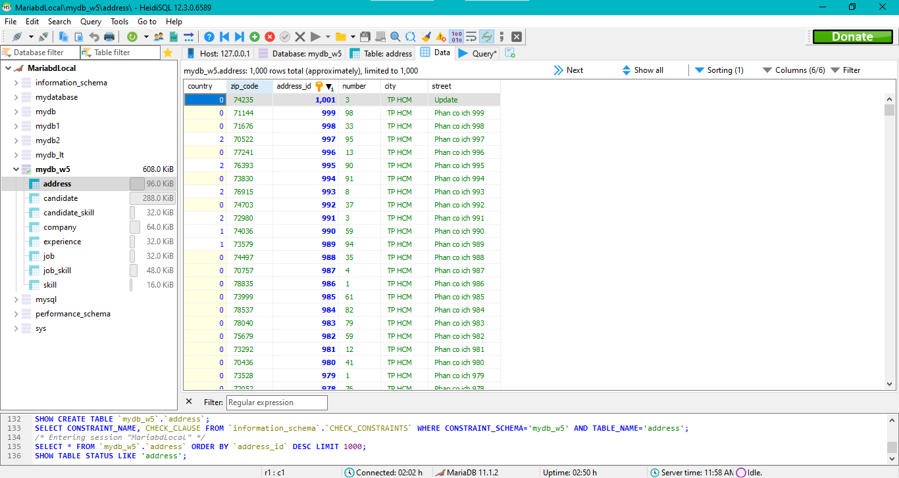
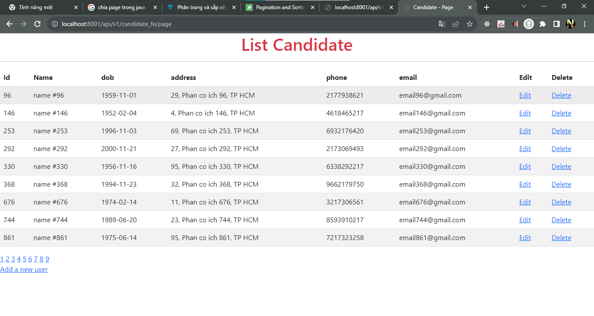

# Start Week 5 - Spring boot

## Tai lieu
* [Link bt](https://github.com/AVan-Git/TH_WorldWideWeb/blob/bt-week5/week5_SpringBoot_JPA_Mariadb/lab1-week5-springboot-jpa-mariadb/taiLieu/lab-week-05.pdf)
* [query lab1 - week 5](./taiLieu/sql/query.sql)
* tài liệu [web spring](https://spring.io/guides/tutorials/rest/)

## Anh minh hoa
### anh soure code

### Anh mariadb

### anh web - postman

### Reference Documentation

For further reference, please consider the following sections:

* [Official Gradle documentation](https://docs.gradle.org)
* [Spring Boot Gradle Plugin Reference Guide](https://docs.spring.io/spring-boot/docs/3.1.4/gradle-plugin/reference/html/)
* [Create an OCI image](https://docs.spring.io/spring-boot/docs/3.1.4/gradle-plugin/reference/html/#build-image)
* [Spring Data JPA](https://docs.spring.io/spring-boot/docs/3.1.4/reference/htmlsingle/index.html#data.sql.jpa-and-spring-data)
* [Spring Boot DevTools](https://docs.spring.io/spring-boot/docs/3.1.4/reference/htmlsingle/index.html#using.devtools)
* [Spring Web](https://docs.spring.io/spring-boot/docs/3.1.4/reference/htmlsingle/index.html#web)
* [Rest Repositories](https://docs.spring.io/spring-boot/docs/3.1.4/reference/htmlsingle/index.html#howto.data-access.exposing-spring-data-repositories-as-rest)

### Guides

The following guides illustrate how to use some features concretely:

* [Accessing Data with JPA](https://spring.io/guides/gs/accessing-data-jpa/)
* [Building a RESTful Web Service](https://spring.io/guides/gs/rest-service/)
* [Serving Web Content with Spring MVC](https://spring.io/guides/gs/serving-web-content/)
* [Building REST services with Spring](https://spring.io/guides/tutorials/rest/)
* [Accessing JPA Data with REST](https://spring.io/guides/gs/accessing-data-rest/)
* [Accessing Neo4j Data with REST](https://spring.io/guides/gs/accessing-neo4j-data-rest/)
* [Accessing MongoDB Data with REST](https://spring.io/guides/gs/accessing-mongodb-data-rest/)

### Additional Links

These additional references should also help you:

* [Gradle Build Scans – insights for your project's build](https://scans.gradle.com#gradle)

